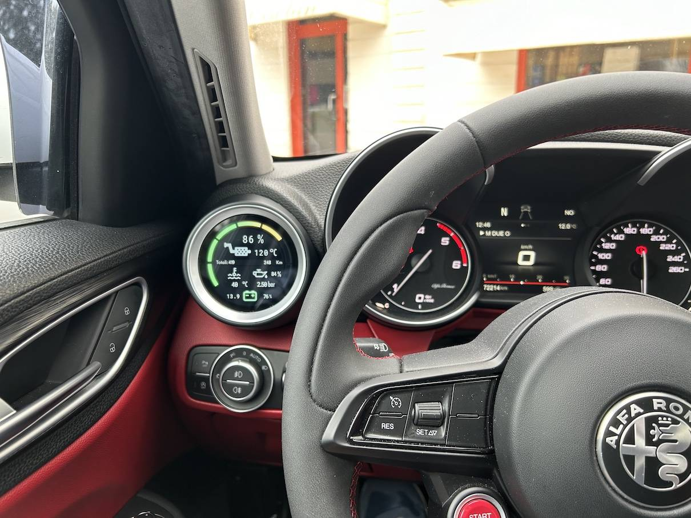

### [UPDATE 05/02/2025]
Some Bug fixing related to broadcast packets handling.

### [UPDATE 29/01/2025]

Introduced new unified library to connect **OBD2 CanBus** through Bluetooth Dongle or 2 wire using a transceiver like the SN65HVD230. 

You can find info about my OBD2 Library here: **https://github.com/dixtone/OBD2**

With this important update, now you can:
1) connect directly to canbus or using bluetooth, simply changing platformio.ini build_flags
2) when using direct connection, you can disable your start&stop by simulating user press button on panel, after device starts
3) reading Engine Oil pressure (finally!!!)

#### final result: ####

#### Here is and example about direct connection to canbus: ####

Removing button panel, you can take a wire from pin 5 and check with a multimeter: when you press start and stop button disabler, you have to read about 1.5kΩ to GND. 
This means using upper schematics, that pulling down GPio pin with 1.5kΩ resistor, you can emulate user press button

Removed unused libraries, code clean and optimizations.

********

I share this project to take control of regeneration status in your Alfa Romeo Giulia or Stelvio Diesel.

Stopping regenerations on this type of engine can cause many problems, such as oil quality degradation, engine oil level increase, oil pressure issues and oil in the intake filter.
As Giulia owner, I think this car deserves to be treated as it is: a masterpiece and I want to minimize all possible component breakages.

The purpose of this project is very simple: it uses an OBD2 Bluetooth 4 adapter to read the parameters from the diagnostic socket, and show on the screen when the car performs DPF regeneration.

All information you can get are:

DPF:
1) regeneration process status
2) total number of regenerations
3) clogging
4) exaust temp
5) engine colant temp (water)
6) battery IBS status and voltage
7) oil quality/degradation
8) oil level

ENGINE:
1) differential pressure of DPF
2) turbo boost pressure
3) engine butterfly valve %
4) **Start & Stop disabling (NEW HOT!)** (when direct canbus connection!)
   
KEYS and Remote (useful to get how many copies of key/remote exists)
1) Key Number and Last used
2) Remote Number and Last used

SERVICE:
1) oil degradation
2) oil level
3) last service date
4) total number of services
5) remain km to service
6) remain days to service
7) **OIL pressure (NEW HOT!)** (when direct canbus connection!)

BATTERY:
1) Battery voltage
2) IBS charge level %
3) Battery temperature

DIESEL:
1) temperature
2) pressure
3) water presence

TIRES:
1) temperature for all 4 TPMS
2) pressure in bar for all 4 TPMS

... and soon (having time to add :) )

Project is not full completed: i want to add the READ/CLEAR DTC functionality and some more features.

I used some existent libraries to complete the project:
1) ~~A customized and light version of ELMduino  https://github.com/PowerBroker2/ELMduino~~
2) A customized version of DWIN DGUS HMI Arduino Library https://github.com/dwinhmi/DWIN_DGUS_HMI/tree/master
3) ESP32 Buzzer Library https://github.com/hammikb/ESP32-Buzzer
4) ~~Esp32-SoftwareSerial  https://github.com/junhuanchen/Esp32-SoftwareSerial/tree/master~~
5) WS2812Led https://github.com/RadioShuttle/WS2812Led

The project can be used as is: I do not provide any guarantee or responsibility in case of damage caused to your vehicle or person.

****************** 

Project is based on ESP32 and Dwin Display DMG40960F040_01WTC (COF display 960x400 res) or DMG48480C028_03WTC (COB display 480x480 res).
You can use display as you want but you need to design your own graphics.

This is the schematics: 

and my own PCB Design to support COB and COF display or only COF:

You can find display used here: 

COF: https://it.aliexpress.com/item/1005005579119952.html

COF ADAPTER to burn project (HDL662S) : https://it.aliexpress.com/item/1005002346359419.html

COB: https://it.aliexpress.com/item/1005005479523806.html

COB FLAT CABLE (10Pin FCC1015A): https://it.aliexpress.com/item/1005002346359419.html

You can use my coupon code: <i><strong>DWINSPINA</strong></i>  to obtain some discount

****************** 

If you appreciate my work, pay me a coffee: 

****************** 

Here is some pics of working project

